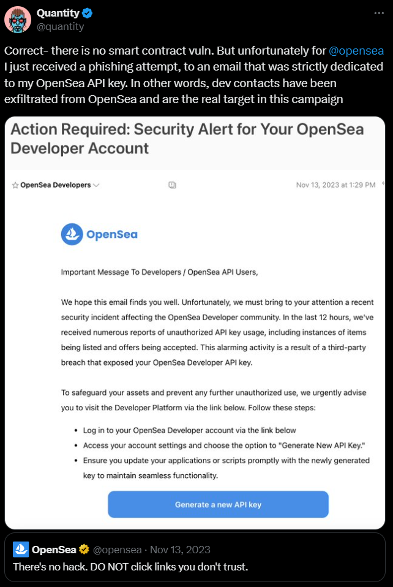
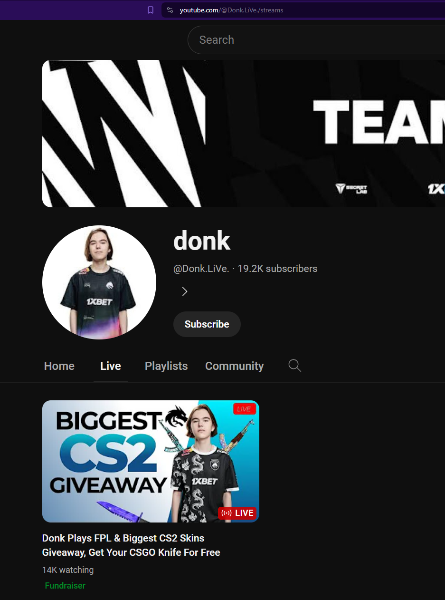
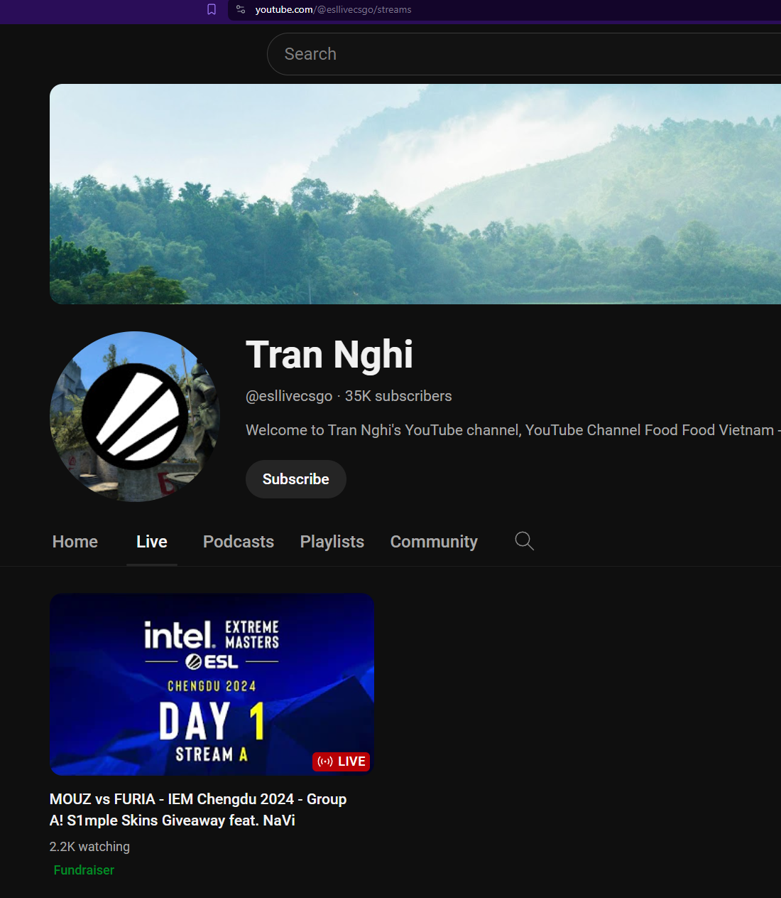
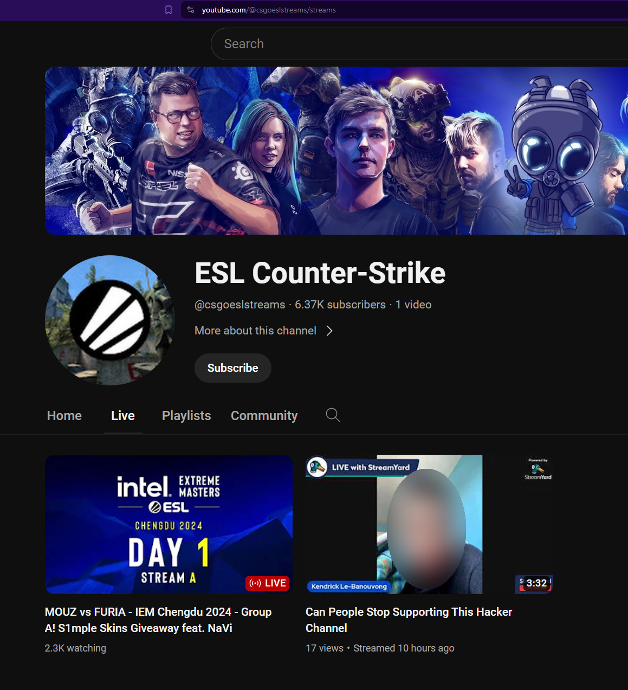

## Taking a look back at the OpenSea Phishing Attack 

For those unaware of the incident, the OpenSea marketplace is by their own words the "largest NFT marketplace". As such OpenSea was the target of several phishing campaigns in the past 2 years. 

These campaigns usually are easy to spot by their call to action (usually to fill something private or critical to your account)
  

In this case, the phishing email attempts to get the user to generate another api key (one that is fake), where instead the site where you input your key will be used to steal the user's NFT.
 
Note that the email also addresses the user simply as "message to Developers/OpeanSea API Users". Obviously an email that uses your actual name shouldn't always be trusted, but it should be another signal to be wary of an email if it does not use your username. 

In general, whenever an email asks you to perform a security related operation like changing/updating sensitive information, you should always go directly to the official website to confirm any issues.

After being reminded of this Phishing campaign from about a year ago, with AI on the rise, I wanted to observe for myself the various ongoing phishing campaigns and, unfortunately there exists a significant amount, right on youtube.com, the fake "livestreams"

## Fake Livestreams

### How do Channels Get Hijacked

How do channels get hijacked in the first place? Generally the impersonators will hijack a youtube channel by getting an unsuspecting user to open a file as described here:

<iframe height="400px" width="100%"
src="https://www.youtube.com/embed/nYdS3FIu3rI">
</iframe>

*tl;dw is that they will send an email with an enticing offer and unbeknownst to the youtuber, the email is attached with malicious code to hijack their channel when run.*   

:::tip
I strongly recommend watching the video as it goes into greater detail about the phishing campaign!
:::

  
*a screenshot of the video detailing how the "pdf" file is actually a "screen saver" file attempting to spoof itself as a non-malicious pdf file.*

### CS2 Fake LiveStreams (Designed to steal Steam User Data)

The goal of these CS2 "Livestreams" is to try to steal your Steam user data, by filling out a form you presume will be to login to Steam, but it's not.

While the first category of examples im about to share do not employ AI, they do use impersonation. These channels will impersonate official esport players/organizations to get users to click their stream: 

*(Channels posing as the famous CS:GO player [s1mple](https://liquipedia.net/counterstrike/S1mple))*

:::tip
Before even clicking their video, check out their channel and see if it has any content. Usually these will have no content except a livestream, and also have a suspicious username (in their address bar)
:::

Notice the @ name has various symbols alongisde the name, and has only 1 video, the "livestream".

Once users click on a stream, they will be greeted by either a vod (video on demand) stream, that is, a "livestream" of a video that the impersonator downloaded. 

Fortunately, for these "livestreams" (which are VODs), there is a huge tell that these are clearly pre-recorded videos that they download:

See the highlighted section on the bottom left of the VOD *(QR code is intentionally blurred)*? 
This is on every client on CS2 which tells you the date and some telemetry information for Valve devs. Notice that it's being recorded on Dec 11th (2023) when it's already April 2024!

As for the content of what they are offering, these impersonators claim to offer "free" skins by going to their website. 

When you first enter the site, they have a "captcha" which is merely a veil to make the site seem more legit even though, it doesn't actually go through a captcha.

In addition, if you check the header, 
the referrer policy is "unsafe-url" which by mozilla docs is can be used for malicious purposes.

If you try to check out their website, they've done some pretty clever things to try and fool players. 

1. They have a "captcha" which is just to make you feel like the site is "secure".
2. When you refresh the site does not change and remember's the skin you "won" (it also happens to be the same skin you win every time you enter the site w/ a new cookie)
3. You are prompted with what looks like a legit Steam logon form (more on that down below).

*Notice when you refresh the page, there's a single frame of the "case" before switching over to the skin you "won".*

Finally, it "pops up" a steam login page except this pop up was not real! 

:::note
My browser settings for pop ups are blocked by default, so this is likely not a pop-up!
:::

**Naturally, the site itself is built to look nearly identical to that of steam's actual login splash page and does a great job in doing so**

*A look at the real login landing page for Steam.*

Some things to notice about the "form" itself
1. The QR code does not work (because it's a temporary login code generated by Steam). 
2. The address bar is suspiciously unnatural; see how in the link itself there's a small gap
3. There's snow "falling" behind this popup (from the css of the website), when it's supposed to be a popup. That should not happen.

Still, if you didn't know what to look for, you could definitely get fooled by this, it's very impressive.

:::caution
**Q:** Why are they trying to steal Steam user data?  
**A:** Often times, accounts that this is targetting (Steam users who are aware of Counter-Strike) will likely have skins in their account and they will attempt to trade it off and sell it (Steam has some safeguards that delay such opportunists)
:::

### CS2 Esports Fake Livestreams
Remember when I described mentioned esport orgs being impersonated? With those, they copy the stream's vods. In this case, the impersonation is clearer because of the checkmark and a more obvious comparison:

official ESL channel

Notice the @ does not match up, is not a verified channel, and the name and about page suggests this is a hijiacked channel.

You can see here with this channel that there's even another video from the youtuber warning others about how their channel got hacked.
They do not detail how exactly it happened, but I presume likely they opened a file without knowing it was malicious.

### Crypto Streams (Designed to Steal Cryptocurrency)

Now what about the crypto related scams? These ones aren't quite phishing campaigns but I thought it was worth sharing nonetheless. Similar to the CS2 "livestream channels", these ones target the crypto audience. 

As you can see here, in this case, the channel hijacked WAS a verified youtuber (denoted by their checkmark) which makes it hard to spot differences (from the official channel its impersonating), but as you'll notice, the channel itself is not quite the same as the channel name as the videos it showcases below the livestream, a small difference you wouldn't notice on a first glance

Note how the channels all seem to say ripple, except the livestream, if you are paying attention. 

:::note
I believe this is a cooldown based on YouTube's end where it doesn't update all aspects of your channel to your new name until a certain amount of time has passed
:::

What's really interesting is that in the "livestream" itself, it loops 2 videos. One video is the normal actual podcast that takes place, and the second video is AI generated, based off of the vod and then modified to make it sounds realistic enough. The scary part is it's quite believable, save for some small portions.

Here's a short clip showing what i mean:

<iframe height="400px" width="100%"
src="https://www.youtube.com/embed/iQzbwCpxaqw">
</iframe>

Again, even though it's still fairly obvious with the poor lip syncing (presumably done thru editing and not AI), the audio portion is still good enough that some would be tricked into thinking that this was actually the person speaking about the "drop". 

If you compare AI with what it was 2 years ago, it'd look night and day. Honestly, it's pretty scary how accurate AI is becoming.

#### How Did the Channels Get Hijacked?
While we have a general idea how channels get hijacked, I  dug a bit further to see what these specific youtubers (being hijacked in the clips I shared here) are saying about the situation. 

Rather than solely contacting via email, these phishing campaigns are now also using twitter as another means of sending malware. Though I havent personally tried it yet, I think it may be fun to see if twitter does scan for malware to an extent. 

>According to A+Start, he clicked on a file without being aware of what had happened until it was too late. 

I also found another person tweeting about his situation:

Although I am not sure if the malware itself has persistence, its definitely very scary that it's a possibility.

X (formerly known as twitter) is undoubtedly a gold mine for anyone looking to start phishing campaigns. Since anyone can "purchase" a verified checkmark, people will likely associate that with a degree of security, when it is not the case. 
I only expect phishing campaigns to rise (on Twitter) for this reason :fearful:

:::warning
Do not trust any files from untrusted sources! Even if it's from someone who looks reputable, always triple check before opening files.

For example, observe file size and file type (properties) and scan files. 
:::

Obviously this is only the current chapter (as of April) for these phishing attacks on YouTube as they will constantly hop from trend to trend (earlier when LinusTechTips was hacked, his channel was converted to a Tesla channel), to avoid YouTube's detection system. 

Will there be an end to these issues? Honestly I doubt it. With AI, phishing techniques will only become even more advanced and believable. AI will only continue to advance, and so will the phishing awareness campaigns needed to combat these issues.
 
 Still, I hope this blog was informative! :smile: