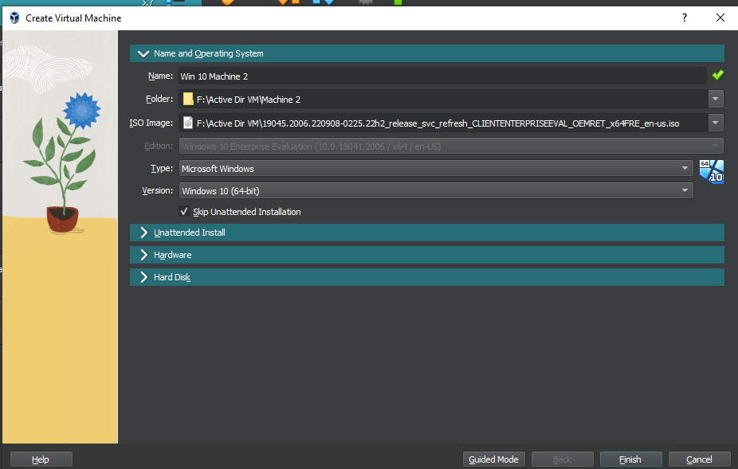
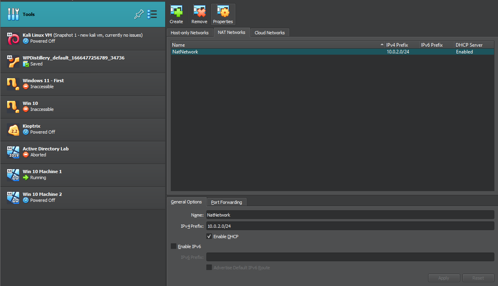
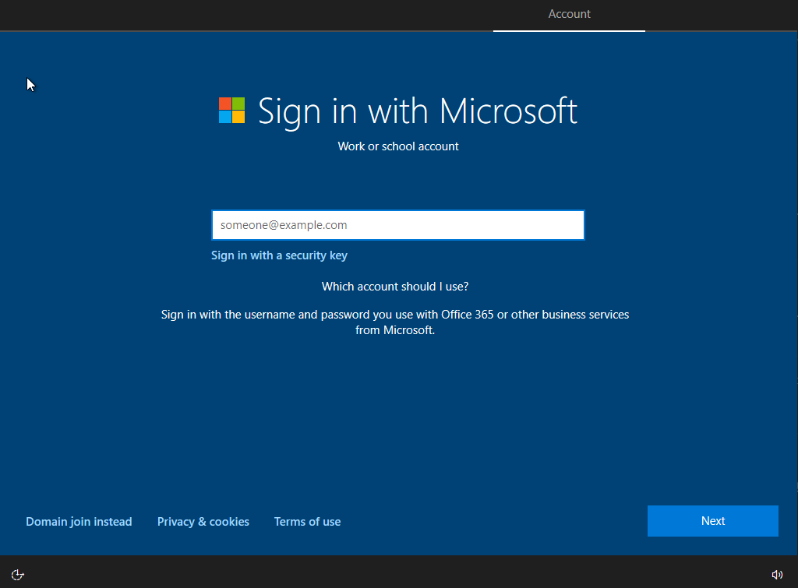
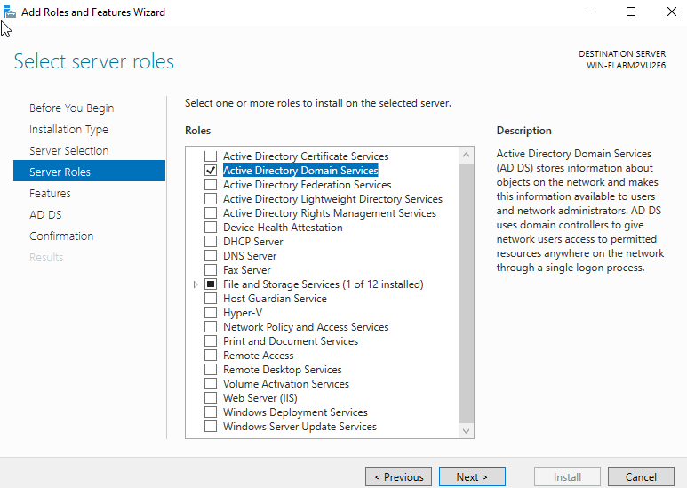
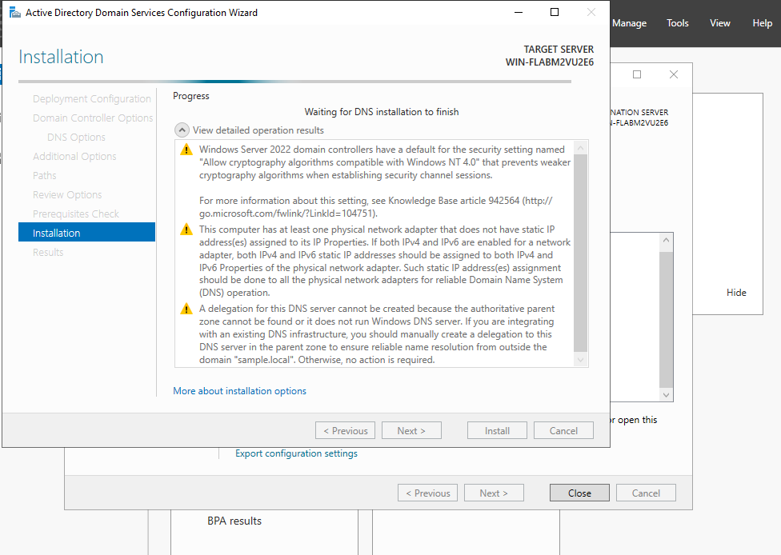
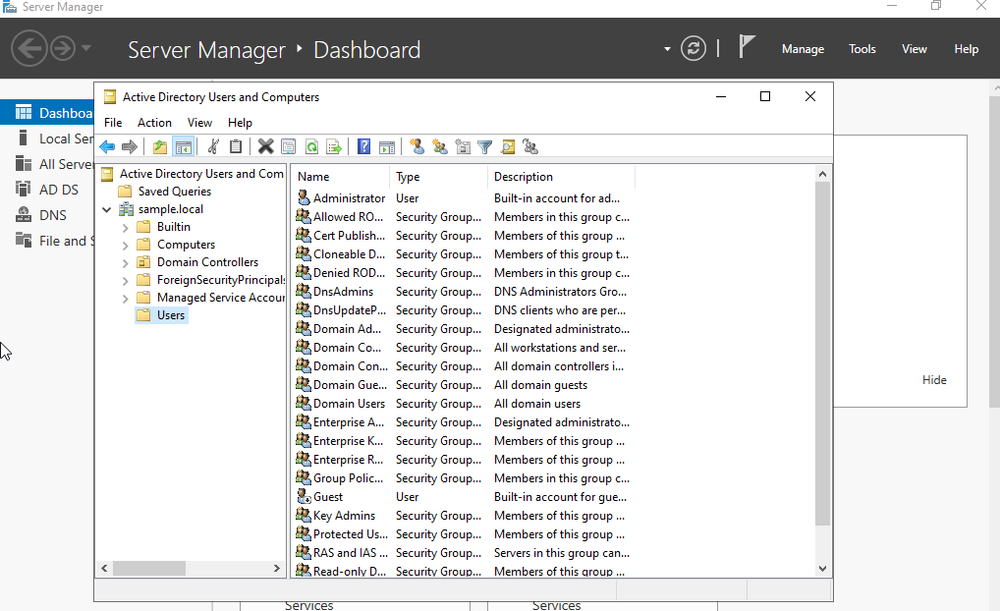
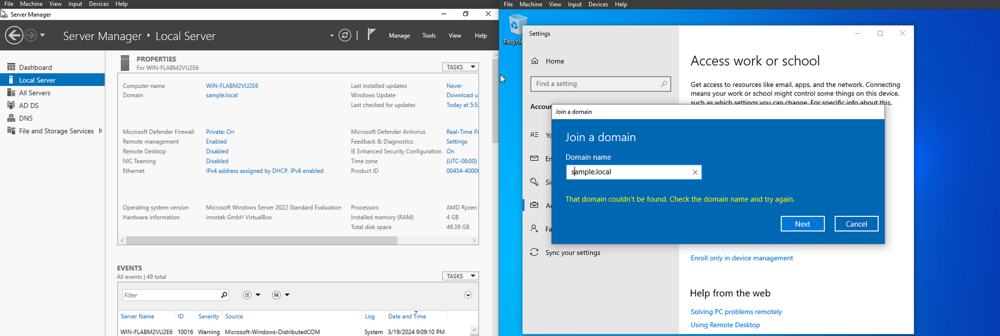

In this lab I set up a Windows Server 2022 Machine, and utilized several Windows 10 VMs. The goal of this lab is to learn more about the tools Windows Server provides and to mimic that of a real network. 

For the setup, I used VirtualBox as this was the most convenient!

:::note
Microsoft has their own [**Free Module**](https://learn.microsoft.com/en-gb/training/modules/introduction-to-ad-ds/1-introduction) on the fundamentals to AD DS 
:::

Firstly, I downloaded the windows server 2022 .iso [files](https://www.microsoft.com/en-us/evalcenter/download-windows-server-2022) and the windows 10 .iso [files](https://www.microsoft.com/en-us/evalcenter/download-windows-10-enterprise) via Microsoft. 

(Always make sure to verify the .iso files when possible using tools like certutil to match the Hash!)

*Matching hashes from adguard.net*

After downloading the ISOs, I set up the virtual machines (both setup processes are very similar)

Simply give it a name and attach the respective .iso for the machine you are creating. 

*Setup for a Windows 10 Machine* (If the setup looks slightly different it may be because you are in Guided Mode)

Then I proceeded to launch the VMs, and finish the Windows setup as described in the writeup.

:::note
Note that you CAN launch multiple VMs at a time, but depending on the host computer may run slower!

I also found that sometimes my vm instances would abort when running multiple VMs.
:::

Next, I configured the network on VirtualBox, in order to create a simulated network between the AD VM with the other Win 10 VMs.

Next, when we launch our Win 10 machines again and proceed with setup, we can "Domain Join Instead" and proceed with setup as normally.

I then configured the network for the Win 10 VM with the Server, by getting the IP address of my Server:

Here, we can choose the features to add within the server.

I let the process complete so that Acive Directory would be installed. (The server will restart)

In the below screenshots, I then created a user:

In this environment, I set the password to never expire, though you can opt for different settings.

When it comes to password expiries, NIST notes:
>Users tend to choose weaker memorized secrets when they know that they will have to change them in the near future. When those changes do occur, they often select a secret that is similar to their old memorized secret by applying a set of common transformations such as increasing a number in the password. 
>[Source](https://pages.nist.gov/800-63-FAQ/#q-b05) (q-b05)

As a result, enforcing password expiries may actually bring more harm than improve security. Such tools like MFA can bring more benefits than using password expiries.

Logging into our Win 10 VM again, we will connect to the Domain

*Make sure that the Server VM is running, otherwise the domain won't be recognized.* Also note that the login (username) will be based on the user logon name you provided!

Now, the VM will restart and you can sign on! (on the other user)

At this point, I will play around with the settings to understand some of the tools provided by Windows Server. 

:::tip
Big thanks to Joshua Green for his tutorial on setting up a [home lab]!(https://drive.google.com/file/d/1YgtiSxaitgIpNsu5HuIYzOV49pnv4iw8/view?pli=1)

*This post is mostly to show what I learned and noted!*
:::